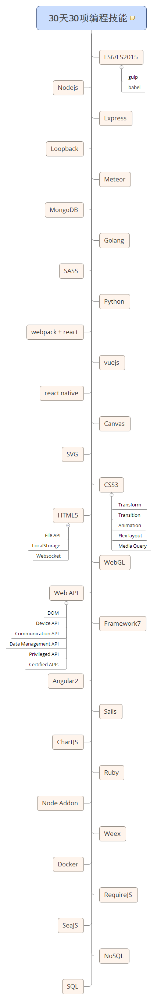

# 30 days 30 web programming skills

## Skill list
 - [ES6/ES2015](https://babeljs.io/docs/learn-es2015/)
 - [Node.js](http://www.nodejs.org/)
 - [Node.js AddOn](https://nodejs.org/docs/latest/api/addons.html)
 - [CSS3](http://www.w3schools.com/css/css_navbar.asp)
    - [Media Query]
    - [Flex layout]
    - [Transform]
    - [Transition]
    - [Animation]
 - [HTML5](http://www.w3schools.com/html/default.asp)
    - [File API](https://www.w3.org/TR/FileAPI/)
    - Local Storage
    - Websocket
    - [Web SQL](https://www.w3.org/TR/webdatabase/)
    - Web Form 2.0
    - [Web Workers](https://www.w3.org/TR/workers/)
 - [Web API](https://developer.mozilla.org/en-US/docs/Web/API)
    - [DOM](https://developer.mozilla.org/en-US/docs/Web/API/Document_Object_Model)
    - [Device API]
    - [Communication API]
    - [Data Management API]
    - [Privileged API]
    - [Certified API]
 - [Canvas](https://developer.mozilla.org/en-US/docs/Web/API/Canvas_API) [Canvas tutorial](https://developer.mozilla.org/en-US/docs/Web/API/Canvas_API/Tutorial)
 - [WebGL](https://developer.mozilla.org/en-US/docs/Web/API/WebGL_API)
 - [SVG](https://developer.mozilla.org/en-US/docs/Web/SVG)
 - [ChartJS](http://www.chartjs.org/)
 - [SASS](http://www.sass-lang.com/)
 - [AngularJS](https://angularjs.org/)
 - [Angular2](https://angular.io/)
 - [VueJS](http://vuejs.org/)
    - [vuex](https://github.com/vuejs/vuex)
 - [ReactJS](https://github.com/facebook/react) [docs](https://facebook.github.io/react/)
    - [redux](http://redux.js.org/)
 - [React Native](https://github.com/facebook/react-native)
 - [Framework7](http://framework7.io/)
 - [Weex](http://alibaba.github.io/weex/)
 - [Express](https://expressjs.com/)
 - [Loopback](http://loopback.io/)
 - [Meteor](https://www.meteor.com/)
 - [SailsJS](http://sailsjs.org/)
 - [Golang](https://golang.org/)
 - [Ruby](https://www.ruby-lang.org)
 - [Python](https://www.python.org/)
 - [RequireJS](http://requirejs.org/)
 - [SeaJS](http://seajs.org/docs/)
 - [SQL](http://www.w3schools.com/sql/)
 - [NoSQL](http://nosql-database.org/)
 - [MongoDB](https://www.mongodb.com/)
 
## Diagram
 
 